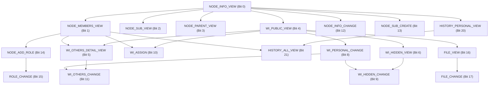

# 🛡️ 24비트 권한 체계 가이드 및 의존성 명세 (Authority System Guide)

본 문서는 클라이언트(Frontend / Desktop App / VSCode Extension) 개발자가 **24비트 권한 비트마스크(Bitmask)**를 해석하고, UI 상에서 권한 토글/설정 화면을 구현할 때 준수해야 하는 **비트 정의, 권한 간 계층 의존성(상위-하위 관계), 연계(묶음) 규칙, 프론트엔드 연산 가이드**를 설명합니다.

---

## 1. 24비트 권한 비트맵 (Bit Position Overview)

> **포맷 규격**: 24자리 2진수 문자열 (Big-Endian 표기, `Bit 23`이 맨 앞, `Bit 0`이 맨 끝)  
> 예시: `"001100111111111101111111"` (MANAGER 권한)

```
Bit:  23 22 21 20 19 18 17 16 15 14 13 12 11 10  9  8  7  6  5  4  3  2  1  0
      │  │  │  │  │  │  │  │  │  │  │  │  │  │  │  │  │  │  │  │  │  │  │  └─ NODE_INFO_VIEW
      │  │  │  │  │  │  │  │  │  │  │  │  │  │  │  │  │  │  │  │  │  │  └──── NODE_MEMBERS_VIEW
      │  │  │  │  │  │  │  │  │  │  │  │  │  │  │  │  │  │  │  │  │  └─────── NODE_SUB_VIEW
      │  │  │  │  │  │  │  │  │  │  │  │  │  │  │  │  │  │  │  │  └────────── NODE_PARENT_VIEW
      │  │  │  │  │  │  │  │  │  │  │  │  │  │  │  │  │  │  │  └───────────── WI_PUBLIC_VIEW
      │  │  │  │  │  │  │  │  │  │  │  │  │  │  │  │  │  │  └──────────────── WI_OTHERS_DETAIL_VIEW
      │  │  │  │  │  │  │  │  │  │  │  │  │  │  │  │  │  └─────────────────── WI_HIDDEN_VIEW
      │  │  │  │  │  │  │  │  │  │  │  │  │  │  │  │  └────────────────────── (Bit 7 Reserved)
      │  │  │  │  │  │  │  │  │  │  │  │  │  │  │  └───────────────────────── WI_PERSONAL_CHANGE
      │  │  │  │  │  │  │  │  │  │  │  │  │  │  └──────────────────────────── WI_HIDDEN_CHANGE
      │  │  │  │  │  │  │  │  │  │  │  │  │  └─────────────────────────────── WI_ASSIGN
      │  │  │  │  │  │  │  │  │  │  │  │  └────────────────────────────────── WI_OTHERS_CHANGE
      │  │  │  │  │  │  │  │  │  │  │  └───────────────────────────────────── NODE_INFO_CHANGE
      │  │  │  │  │  │  │  │  │  │  └──────────────────────────────────────── NODE_SUB_CREATE
      │  │  │  │  │  │  │  │  │  └─────────────────────────────────────────── NODE_ADD_ROLE
      │  │  │  │  │  │  │  │  └────────────────────────────────────────────── ROLE_CHANGE
      │  │  │  │  │  │  │  └───────────────────────────────────────────────── FILE_VIEW
      │  │  │  │  │  │  └──────────────────────────────────────────────────── FILE_CHANGE
      │  │  │  │  │  └─────────────────────────────────────────────────────── (Bit 18 Reserved)
      │  │  │  │  └────────────────────────────────────────────────────────── (Bit 19 Reserved)
      │  │  │  └───────────────────────────────────────────────────────────── HISTORY_PERSONAL_VIEW
      │  │  └──────────────────────────────────────────────────────────────── HISTORY_ALL_VIEW
      │  └─────────────────────────────────────────────────────────────────── (Bit 22 Reserved)
      └────────────────────────────────────────────────────────────────────── DENY
```

---

## 2. 도메인별 세부 권한 정의

| Bit | 상수 이름 | 분류 | 설명 | 최소 전제 권한 (선행 조건) |
| :---: | :--- | :---: | :--- | :--- |
| **0** | `NODE_INFO_VIEW` | 공간/노드 | 해당 노드의 기본 정보를 식별/조회 가능 (**모든 권한의 최상위 부모**) | - |
| **1** | `NODE_MEMBERS_VIEW` | 공간/노드 | 해당 노드에 배정된 멤버 및 역할 목록을 식별 가능 | `NODE_INFO_VIEW` (Bit 0) |
| **2** | `NODE_SUB_VIEW` | 공간/노드 | 해당 노드의 모든 하위 자식 노드를 탐색/조회 가능 | `NODE_INFO_VIEW` (Bit 0) |
| **3** | `NODE_PARENT_VIEW` | 공간/노드 | 해당 노드의 상위 조상 노드 트리를 탐색/조회 가능 | `NODE_INFO_VIEW` (Bit 0) |
| **4** | `WI_PUBLIC_VIEW` | 업무(WI) | 노드 내 공개(`hidden=false`) 업무 목록을 식별/조회 가능 | `NODE_INFO_VIEW` (Bit 0) |
| **5** | `WI_OTHERS_DETAIL_VIEW` | 업무(WI) | 다른 사용자가 소유한 업무의 상세 내용(설명/댓글)을 조회 가능 | `WI_PUBLIC_VIEW` (Bit 4) + `NODE_MEMBERS_VIEW` (Bit 1) |
| **6** | `WI_HIDDEN_VIEW` | 업무(WI) | 노드 내 숨김(`hidden=true`) 업무를 조회 및 상세조회 가능 | `WI_PUBLIC_VIEW` (Bit 4) |
| *7* | *RESERVED* | - | 예약 비트 (항상 `0`) | - |
| **8** | `WI_PERSONAL_CHANGE` | 업무(WI) | 본인 소유의 업무를 신규 생성/수정/삭제 가능 | `WI_PUBLIC_VIEW` (Bit 4) |
| **9** | `WI_HIDDEN_CHANGE` | 업무(WI) | 숨김(`hidden=true`) 속성 업무를 생성/변경 가능 | `WI_HIDDEN_VIEW` (Bit 6) + `WI_PERSONAL_CHANGE` (Bit 8) |
| **10** | `WI_ASSIGN` | 업무(WI) | 다른 사용자에게 업무를 새로 배정/생성 가능 | `NODE_MEMBERS_VIEW` (Bit 1) + `WI_PUBLIC_VIEW` (Bit 4) |
| **11** | `WI_OTHERS_CHANGE` | 업무(WI) | 다른 사용자의 업무 내용을 수정하거나 삭제 가능 | `WI_OTHERS_DETAIL_VIEW` (Bit 5) + `WI_PERSONAL_CHANGE` (Bit 8) |
| **12** | `NODE_INFO_CHANGE` | 공간 관리 | 노드의 이름, 속성 등의 메타데이터 변경 가능 | `NODE_INFO_VIEW` (Bit 0) |
| **13** | `NODE_SUB_CREATE` | 공간 관리 | 해당 노드 하위에 새로운 서브 노드(부서/팀 등) 생성 가능 | `NODE_INFO_VIEW` (Bit 0) |
| **14** | `NODE_ADD_ROLE` | 역할/인원 | 노드에 멤버를 초대하고 기존 역할을 부여/변경/회수 가능 | `NODE_MEMBERS_VIEW` (Bit 1) |
| **15** | `ROLE_CHANGE` | 역할/인원 | 노드의 커스텀 역할을 생성하고 역할별 24비트 권한을 설정/수정 가능 | `NODE_ADD_ROLE` (Bit 14) |
| **16** | `FILE_VIEW` | 파일/첨부 | 업무에 첨부된 파일을 조회하고 다운로드 가능 | `WI_PUBLIC_VIEW` (Bit 4) |
| **17** | `FILE_CHANGE` | 파일/첨부 | 업무에 파일을 새로 업로드하거나 삭제 가능 | `FILE_VIEW` (Bit 16) |
| *18, 19* | *RESERVED* | - | 예약 비트 (항상 `0`) | - |
| **20** | `HISTORY_PERSONAL_VIEW` | 히스토리 | 본인이 변경한 활동/수정 이력을 조회 가능 | `NODE_INFO_VIEW` (Bit 0) |
| **21** | `HISTORY_ALL_VIEW` | 히스토리 | 노드 내 모든 인원의 변경/활동 전체 이력을 조회 가능 | `HISTORY_PERSONAL_VIEW` (Bit 20) + `NODE_MEMBERS_VIEW` (Bit 1) |
| *22* | *RESERVED* | - | 예약 비트 (항상 `0`) | - |
| **23** | `DENY` | 특수 제어 | **절대 거부 비트**. 이 비트가 ON이면 다른 모든 비트 및 상속 권한을 무시하고 접근 불가 | - |

---

## 3. 권한 간 의존성 및 연계(Cascade) 규칙

UI에서 권한 체크박스(Switch/Checkbox)를 토글할 때 아래 **부모-자식 의존성 체인**을 반드시 강제해야 데이터 무결성이 보장됩니다.



### 🔴 규칙 1: 상위 권한 OFF $\rightarrow$ 모든 하위 권한 자동 OFF (Cascade Disable)
- **`NODE_INFO_VIEW (Bit 0)` 해제 시**:
  - 노드 자체를 볼 수 없으므로 `Bit 1` ~ `Bit 21`의 모든 권한이 **자동으로 OFF** 됩니다.
- **`NODE_MEMBERS_VIEW (Bit 1)` 해제 시**:
  - 멤버/구성원을 식별할 수 없으므로 `NODE_ADD_ROLE (Bit 14)`, `ROLE_CHANGE (Bit 15)`, `WI_ASSIGN (Bit 10)`, `WI_OTHERS_DETAIL_VIEW (Bit 5)`, `WI_OTHERS_CHANGE (Bit 11)`, `HISTORY_ALL_VIEW (Bit 21)`가 **자동으로 OFF** 됩니다.
- **`WI_PUBLIC_VIEW (Bit 4)` 해제 시**:
  - 공개 업무를 볼 수 없으므로 모든 업무 관련 하위 권한인 `WI_OTHERS_DETAIL_VIEW (Bit 5)`, `WI_HIDDEN_VIEW (Bit 6)`, `WI_PERSONAL_CHANGE (Bit 8)`, `WI_HIDDEN_CHANGE (Bit 9)`, `WI_ASSIGN (Bit 10)`, `WI_OTHERS_CHANGE (Bit 11)`, `FILE_VIEW (Bit 16)`, `FILE_CHANGE (Bit 17)`가 **자동으로 OFF** 됩니다.
- **`WI_PERSONAL_CHANGE (Bit 8)` 해제 시**:
  - 본인 업무를 생성/변경할 수 없으므로 `WI_HIDDEN_CHANGE (Bit 9)`, `WI_OTHERS_CHANGE (Bit 11)`가 **자동으로 OFF** 됩니다. (`WI_ASSIGN`과 `FILE_CHANGE`는 독립 유지 가능)
- **`FILE_VIEW (Bit 16)` 해제 시**:
  - `FILE_CHANGE (Bit 17)`가 **자동으로 OFF** 됩니다.
- **`NODE_ADD_ROLE (Bit 14)` 해제 시**:
  - `ROLE_CHANGE (Bit 15)`가 **자동으로 OFF** 됩니다.

---

### 🟢 규칙 2: 하위 권한 ON $\rightarrow$ 필수 선행(상위) 권한 자동 ON (Cascade Enable)
- **`ROLE_CHANGE (Bit 15)` 활성화 시**:
  - `NODE_ADD_ROLE (Bit 14)`, `NODE_MEMBERS_VIEW (Bit 1)`, `NODE_INFO_VIEW (Bit 0)`가 **자동으로 ON** 되어야 합니다.
- **`WI_HIDDEN_VIEW (Bit 6)` 활성화 시**:
  - `WI_PUBLIC_VIEW (Bit 4)`, `NODE_INFO_VIEW (Bit 0)`가 **자동으로 ON** 되어야 합니다.
- **`WI_OTHERS_DETAIL_VIEW (Bit 5)` 활성화 시**:
  - `NODE_MEMBERS_VIEW (Bit 1)`, `WI_PUBLIC_VIEW (Bit 4)`, `NODE_INFO_VIEW (Bit 0)`가 **자동으로 ON** 되어야 합니다.
- **`HISTORY_ALL_VIEW (Bit 21)` 활성화 시**:
  - `NODE_MEMBERS_VIEW (Bit 1)`, `HISTORY_PERSONAL_VIEW (Bit 20)`, `NODE_INFO_VIEW (Bit 0)`가 **자동으로 ON** 되어야 합니다.
- **`FILE_CHANGE (Bit 17)` 활성화 시**:
  - `FILE_VIEW (Bit 16)`, `WI_PUBLIC_VIEW (Bit 4)`, `NODE_INFO_VIEW (Bit 0)`가 **자동으로 ON** 되어야 합니다.
- **`WI_ASSIGN (Bit 10)` 활성화 시**:
  - `NODE_MEMBERS_VIEW (Bit 1)`, `WI_PUBLIC_VIEW (Bit 4)`, `NODE_INFO_VIEW (Bit 0)`가 **자동으로 ON** 되어야 합니다.
- **`WI_HIDDEN_CHANGE (Bit 9)` 활성화 시**:
  - `WI_HIDDEN_VIEW (Bit 6)`, `WI_PERSONAL_CHANGE (Bit 8)`, `WI_PUBLIC_VIEW (Bit 4)`, `NODE_INFO_VIEW (Bit 0)`가 **자동으로 ON** 되어야 합니다.

---

### ⛔ 규칙 3: `DENY (Bit 23)` 제어
- `DENY` 비트가 `1`로 세팅되면 다른 비트들이 `1`이어도 서버 및 DB 레벨에서 **모든 요청이 즉각 거부(Forbidden)** 됩니다.
- UI 상에서는 `DENY` 체크 시 다른 모든 권한 체크박스를 비활성화(Disabled) 처리하는 것을 권장합니다.

---

## 4. 기본 역할(Role Defaults) 비트마스크 표준값

| 역할 이름 | 24비트 비트마스크 문자열 | 16진수(Hex) | 포함된 주요 권한 |
| :--- | :---: | :---: | :--- |
| **`ADMIN`** | `011111111111111111111111` | `0x7FFFFF` | `DENY` 제외 **모든 권한 보유** (비트 0~21 전체 ON) |
| **`MANAGER`** | `001100111111111101111111` | `0x33FF7F` | 전체 업무 관리, 멤버/역할/권한 관리(`ROLE_CHANGE` 포함), 전체 활동 로그 |
| **`MEMBER`** | `000100110000001101010111` | `0x130357` | 본인 업무 생성/변경, 파일 다운/업로드, 개인 활동 로그 |
| **`VIEWER`** | `000000000000000000010001` | `0x000011` | 노드 기본 정보 조회, 공개 업무 목록 조회 (읽기 전용) |