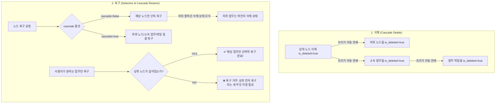

# 📌 데이터 라이프사이클 및 소프트 딜리트 / 복구 비즈니스 로직 정리

---

## 1. 기본 원칙 (Core Principles)

### ① 소프트 딜리트(`is_deleted`) 기반 가시성 제어
- **모든 엔티티(`NODE`, `WORK_ITEM`, `FILE`)는 `is_deleted: boolean` 필드를 응답에 포함**합니다.
- 서버 API(`context/init`, `get_node_detail`, `sync_context`, `get_work_item_detail` 등)는 `is_deleted = true`인 항목도 권한이 있다면 클라이언트에 그대로 전달합니다.
- **클라이언트 UI 렌더링**:
  - **일반 화면(조직도/업무 보드/상세 뷰)**: `is_deleted === false`인 정상 항목만 필터링하여 렌더링
  - **휴지통 / 삭제된 항목 관리 탭**: `is_deleted === true`인 항목만 별도로 모아서 렌더링

---

### ② 삭제 상태 불변성 (Immutability) & 15일 만료 타이머
- **수정 불가 (Update Blocked)**:
  - `is_deleted = true` 상태인 객체는 **수정 API(`updateNode`, `updateWorkItem`, `updateRole` 등) 호출 시 변경이 차단**됩니다. (`400/403` 에러 반환)
- **`updated_at`의 의미 고정**:
  - 삭제된 이후 내용 수정이 불가능하므로, `updated_at`은 **"해당 객체가 삭제된 정확한 일시"**로 보존됩니다.
- **D-day 계산**:
  - 클라이언트는 `(updated_at + 15일) - 현재시간` 공식을 통해 **남은 복구 가능 기간(D-15 ~ D-Day, 시간 단위)**을 정확하게 계산하여 휴지통 UI에 카운트다운을 표시합니다.

---

## 2. 삭제(Delete) vs 복구(Restore) 정책

### ① 삭제 시: 연쇄 삭제 (Cascade Soft-Delete)
- **상위 노드 삭제 시**: 하위 자식 노드들, 소속된 모든 업무(`work_items`), 업무의 첨부파일(`work_item_files`)이 트리거에 의해 자동으로 `is_deleted = true` 처리
- **업무 삭제 시**: 하위 하위 업무(`parent_work_item_id`) 및 연결된 첨부파일(`work_item_files`)이 트리거에 의해 자동으로 `is_deleted = true` 처리

---

### ② 복구 시: 선택적 복구 vs 일괄 복구 (`cascade` 옵션)
복구 API는 `cascade: boolean` 파라미터를 지원하여 두 가지 사용자 경험을 모두 제공합니다:

1. **선택적 복구 (`cascade: false`, 기본값)**:
   - 대상 노드/업무만 단독으로 `is_deleted = false` 복구
   - 하위 노드나 소속 업무들은 삭제 상태(`is_deleted = true`)를 유지하여, 사용자가 원하는 항목만 골라서 복구 가능
2. **일괄 복구 (`cascade: true`)**:
   - 대상 노드/업무와 그에 속한 **모든 하위 자식/업무/첨부파일 트리 전체를 한 번에 일괄 복구**

---

### ③ 복구 시 상위 부모 생존 검증 및 부모 변경 복구 (Orphan 방지)
- **하위 노드 복구 시**: 상위 부모 노드(`parent_node_id`)가 `is_deleted = false`여야 복구 가능 (`P0306`)
- **업무 복구 시**: 
  - 소속 노드(`owner_node_id`)가 `is_deleted = false`여야 복구 가능 (`P0614`)
  - **새 부모 지정 복구 지원**: 기존 상위 업무가 삭제된 상태일 때, 새로운 살아있는 부모 업무(`parent_id`)를 지정하여 즉시 구출 복구 가능 (`P0615`, `P0616`)
- **파일 복구 시**: 소속된 업무(`work_item_id`)가 `is_deleted = false`여야 복구 가능 (`P0618`)

---

## 3. 15일 경과 시 자동 영구 삭제 (Hard Delete & Garbage Collection)

- **정리 대상**: `is_deleted = true`이고 `updated_at < CURRENT_TIMESTAMP - INTERVAL '15 days'`인 노드, 업무, 파일
- **DB 영구 삭제 (`DELETE`)**:
  - `cleanup_expired_deleted_data()` DB 함수를 통해 15일 지난 레코드를 완전히 `DELETE` 처리
  - `ON DELETE CASCADE` 외래키 제약조건에 따라 연관된 히스토리 및 댓글/멘션 데이터도 함께 영구 삭제
- **디스크 물리 파일 삭제**:
  - 영구 삭제 대상 파일 경로(`file_path`)를 C++ 백엔드 서버로 전달하여 `std::filesystem::remove()`로 서버 디스크(`uploads/`)의 실제 파일도 함께 제거
- **실행 주기**: C++ Drogon 서버 기동 중 **24시간 주기(매일 자정) 1회 자동 백그라운드 실행**

---

## 4. 관련 엔드포인트 규격 매핑

| 기능 | Method | URL | 명세서 문서 |
| :--- | :--- | :--- | :--- |
| **노드 상세 조회** | `GET` | `/api/org/nodes?node_id={id}` | [`api/Get/node_detail.md`](api/Get/node_detail.md) |
| **노드 복구** | `PATCH` | `/api/org/nodes/restore` | [`api/Patch/node_restore.md`](api/Patch/node_restore.md) |
| **업무 복구** | `PATCH` | `/api/workItems/restore` | [`api/Patch/work_item_restore.md`](api/Patch/work_item_restore.md) |
| **파일 복구** | `PATCH` | `/api/workItems/files/restore` | [`api/Patch/file_restore.md`](api/Patch/file_restore.md) |
| **전체 초기 동기화** | `GET` | `/api/context/init` | [`api/Get/context_init.md`](api/Get/context_init.md) |
| **증분 동기화** | `GET` | `/api/context/sync` | [`api/Get/sync_context.md`](api/Get/sync_context.md) |
